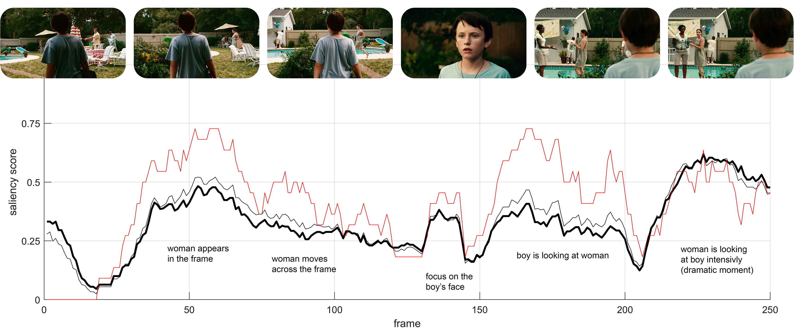

# Are all the frames equally important?
Supporting code to the paper [O. Sidorov, M. Pedersen, N. W. Kim, S. Shekhar "Are all the frames equally important?](https://arxiv.org/abs/1905.07984)



### Geting started 
You need to have [Psychtoolbox-3](http://psychtoolbox.org) and MatLab of fairly recent version installed to run the code. Please refer to the original instructions for installation of the PTB. 

#### Implementation comments
The straightforward way of doing computations (creating a window, blurring the image outside the window) is pretty heavy, and doesn't perform at 30 fps. That's why we prepare cells with original and blurred frames in advance, and only combine them during the experiment with respect to generated mask of the window. Creation of the mask is discussed in details [here](https://www.linkedin.com/pulse/so-you-want-create-circular-binary-mask-matlab-oleksii-sidorov/). In the result, we were able to run HD videos smoothly on a simple laptop. A good powerfull PC surely will allow using Full-HD and higher resolution. If your system is not powerfull enough - try to decrease video resolution, this is a simpliest solution. Although, optimization of the code is still an open question. You are welcome to throw your ideas.

#### Data preparation
The inputs you need to provide are cells `img` and `imgBlur` where `{i}`-th element correspond to i-th frame of the video. Thus, two cells per each video. Specifically, you need to save them as `mat\videoN.mat`, where `N` is a ID of your video.
<\br>
It doesn't matter how you create them. Two options we provide are: 
* Using the code `prepare_videos.mat` and loading mat files between trials
* Generating both cells from frames in a gap between trials

Both options require from you having folder `videoN\` with all the frames as ordered JPG images.

#### Runing the experiment
Specify IDs of the videos as the first arguments of the `trial()` function in `main.m` and run `main.m`.

#### Output
Generated output is a mat file `videoN_obsM.mat` with one 3D variable of the size `frames x rounds x 2` (250 x 5 x 2 for us) :
``` matlab
out(frame, round, 1) = x;
out(frame, round, 2) = y; 
```
 
 `x` and `y` are mouse coordinates when button is pressed and zeros otherwise.
 
 
 ## Good luck in your work ~
